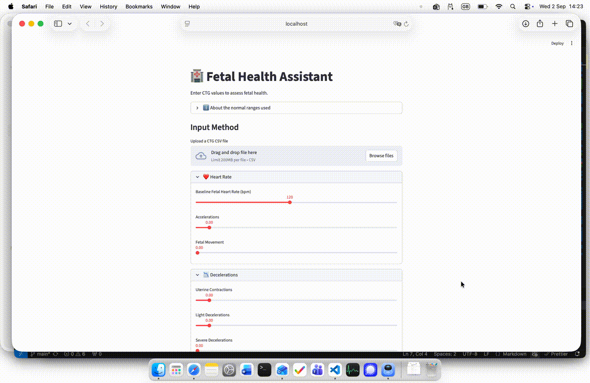

# 🏥 AI-Powered Fetal Health Assistant

> Combining Machine Learning and AI to help healthcare professionals assess fetal health risk — and understand *why*.

🎥 **Live Demo:**



---

## What is this project?

Every year, 295,000 mothers die during or after childbirth — most in low-resource settings where access to specialist care is limited. Cardiotocograms (CTGs) are one of the most affordable tools available to monitor a baby's health during pregnancy, but interpreting them requires medical expertise.

This project builds an AI system that classifies fetal health from CTG data and explains the result in plain English — so that even non-specialists can understand what the numbers mean.

---

## What does it do?

1. Takes CTG measurements as input — either typed in manually or uploaded as a CSV file
2. Classifies fetal health as **Normal**, **Suspect**, or **Pathological** using a trained ML model
3. Shows a colour-coded chart highlighting which specific values are concerning
4. Uses an **LLM (GPT-4o-mini)** to explain the result in simple, everyday language
5. Lets the user ask follow-up questions about the diagnosis

---

## Dataset

The model was trained on the [Fetal Health Classification dataset](https://www.kaggle.com/datasets/andrewmvd/fetal-health-classification) from Kaggle — 2,126 CTG records labelled by three expert obstetricians into three classes:

- `1` → Normal
- `2` → Suspect
- `3` → Pathological

---

## The ML Model

A **Random Forest Classifier** was trained on the dataset with SMOTE (Synthetic Minority Oversampling Technique) applied to handle class imbalance — meaning the model gets more balanced exposure to the rarer Suspect and Pathological cases.

| Class | Precision | Recall | F1-Score |
|---|---|---|---|
| Normal | 0.97 | 0.96 | 0.97 |
| Suspect | 0.83 | 0.86 | 0.85 |
| Pathological | 0.96 | 0.93 | 0.95 |
| **Overall Accuracy** | | | **0.95** |

One known limitation: borderline cases (e.g. low baseline heart rate without decelerations) can still be classified as Normal, reflecting genuine ambiguity in the original expert labels. This is surfaced honestly through the confidence scores shown in the app.

---

## The AI Layer

Once the model makes a prediction, the result and confidence scores are passed to **GPT-4o-mini** via the OpenAI API. The LLM generates a short plain-English explanation of why the model predicted what it did, referencing the specific CTG values that were most concerning. Users can then ask follow-up questions and the LLM maintains the conversation context throughout.

The system prompt is specifically tuned to CTG interpretation — so responses are always grounded in fetal heart rate patterns, not generic medical advice.

---

## Tech Stack

| Layer | Tools |
|---|---|
| Data & ML | pandas, numpy, scikit-learn, imbalanced-learn, joblib |
| LLM | OpenAI API (GPT-4o-mini) |
| UI | Streamlit |
| Visualisation | Plotly |

---

## How to Run

Clone the repo and install dependencies:

```bash
git clone https://github.com/preetha-pallavi/AI-Powered-Fetal-Health-Assistant.git
cd AI-Powered-Fetal-Health-Assistant
pip install -r requirements.txt
```

Create a `.env` file with your OpenAI key:

```
OPENAI_KEY=your_api_key_here
```

Run the app:

```bash
streamlit run app.py
```

---

## Project Structure

```
AI-Powered-Fetal-Health-Assistant/
│
├── models/
│   ├── fetal_health_model.pkl       # Trained Random Forest model (with SMOTE)
│   └── fetal_scaler.pkl             # Fitted StandardScaler
│
├── notebooks/
│   └── Fetal_Health_Classification.ipynb  # EDA + model training
│
├── data/
│   ├── fetal_health.csv             # Original dataset
│   └── ctg_test_sample.csv          # Sample file for testing
│
├── app.py                           # Streamlit UI
├── Fetal_health_LLM.py              # OpenAI LLM logic + follow-up Q&A
├── requirements.txt
└── README.md
```

---

## Branches

| Branch | Description |
|---|---|
| `main` | Full project — ML model, app, and LLM integration |
| `llm-integration` | Development branch for LLM-related files |

---

## Key Features

- 95% overall classification accuracy
- SMOTE applied to handle class imbalance between Normal, Suspect and Pathological cases
- Colour-coded CTG feature chart showing which values are concerning
- CSV file upload for automatic value reading
- Collapsible input sections grouped by clinical category
- LLM explanations in plain, non-alarming everyday language
- Follow-up Q&A with full conversation context
- Reference ranges sourced from FIGO guidelines and dataset distribution
- Medical disclaimer throughout

---

## Known Limitations

The model reflects the labels in the original dataset, which were assigned by human experts. In genuinely borderline cases, the model may still predict Normal even when some values look concerning. This ambiguity is intentional — the confidence scores and the LLM explanation are designed to surface it rather than hide it.

---